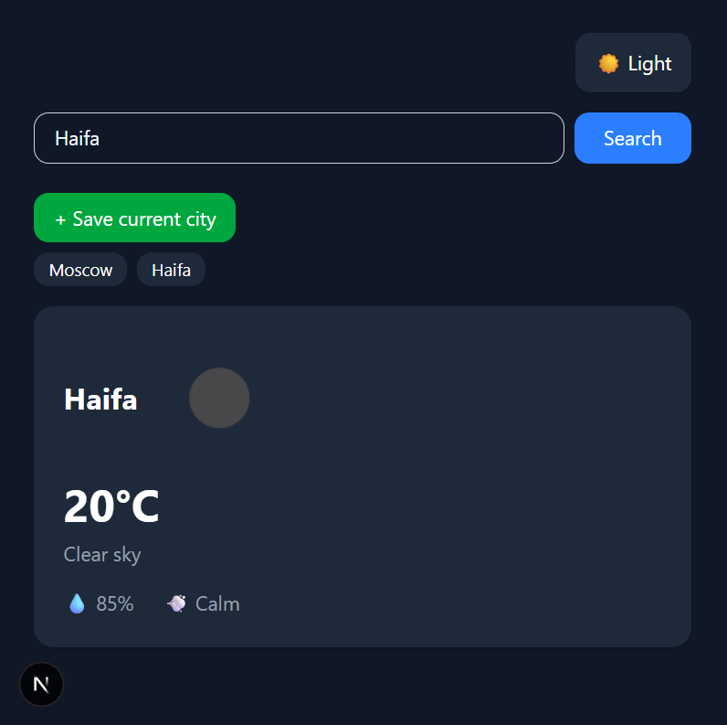

# 🌤️ Weather Dashboard

A modern weather dashboard built with Next.js 14, TypeScript, and React Query.

## ✨ Features

- 🔍 Search weather by city
- 💾 Save favorite cities
- 🌙 Dark / Light theme
- ⚡ Smart caching with React Query
- 🔒 Secure API key handling via server-side proxy
- 📱 Responsive design

## 🛠️ Tech Stack

- **Framework:** Next.js 14 (App Router)
- **Language:** TypeScript
- **Styling:** Tailwind CSS
- **Data Fetching:** React Query (TanStack Query)
- **API:** OpenWeatherMap
- **Deployment:** Vercel

## 🚀 Getting Started

1. Clone the repository
   
   git clone https://github.com/dralex1982/weather-dashboard.git

2. Install dependencies
   
   npm install

3. Create `.env.local` and add your API key
   
   OPENWEATHER_API_KEY=your_api_key_here

4. Run the development server
   
   npm run dev

5. Open http://localhost:3000

## 🔑 Environment Variables

| Variable | Description |
|----------|-------------|
| `OPENWEATHER_API_KEY` | API key from openweathermap.org |

## 📸 Preview

